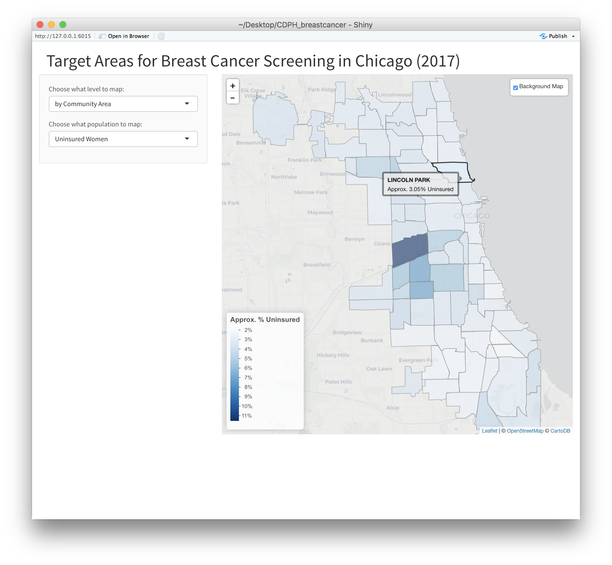

# Predicting Insurance Status and Risk of Breast Cancer
For this project, data scientists at Civis Analytics trained and cross-validated multiple classifier models. We used our models to predict the likelihood that a woman is uninsured, as well as the likelihood that a woman is at-risk of developing breast cancer. We then used this information to create a chloropleth map of Chicago that highlights areas where there are likely to be women who are uninsured and/or have a high risk of breast cancer. The Chicago Department of Public Health can operationalize the results of this project to conduct a targeted breast cancer screening campaign, so that women with the highest likelihood of developing breast cancer and/or not having health insurance are getting screened.

Below is a screenshot of the interactive map we produced:

This GitHub repository provides all of the source code used to develop the model as well as create the map visualization. Some of the data used in this project are also available in this repository. However, this code relies heavily on proprietary data and software that belong to Civis Analytics, so it cannot be executed without these resources. Furthermore, much of the code has been altered to protect such proprietary information. Nevertheless, it is still possible to review the code and understand the methodology we used to arrive at our results. 

## Data 
We utilized three datasets in this project:
1. Proprietary modeling data from Civis Analytics
2. Responses from a survey conducted from October to November 2017 by Civis Analytics
3. Behavioral Risk Factor Surveillance System (BRFSS) 2016 data, which is publicly available at: https://www.cdc.gov/brfss/annual_data/annual_2016.html

Only the de-identified survey response data from female participants (female_survey_data.csv) is available in this repository. 

We also used publicly available data about breast cancer incidence rates in Chicago (CA0514.dat) to do a rough validation of our model. The data can be downloaded from this repository, or at this link: http://www.idph.state.il.us/cancer/statistics.htm.

3,147 females participated in our survey and provided adequate response data. We asked participants about their insurance status, as well as a battery of questions related to breast cancer risk factors as identified by the Centers for Disease Control (CDC) (https://www.cdc.gov/cancer/breast/basic_info/risk_factors.htm) and Cancer Treatment Centers of America (https://www.cancercenter.com/breast-cancer/risk-factors/). 

To prepare the data for modeling, we matched the survey responses we collected to Civis Analytics’s proprietary data. We then recoded the BRFSS 2016 data and appended it to our data. A R script to clean and recode the BRFSS 2016 data is available in this repository (“BRFSS2016_ETL.R”). 

We then used SEER 2010-2012 data from the National Cancer Institute (NCI) to identify baseline risk values for breast cancer based off age and race. Using demographic information in Civis Analytics’s proprietary data, we were able to assign one of these baseline risk values to each individual in our data set. We also assigned relative risk values to each survey response by drawing on academic studies of breast cancer risk factors. We then multiplied the baseline risk values for breast cancer with the relative risk values assigned to each survey response, which resulted in an overall relative risk value for breast cancer. Next, we recoded our breast cancer risk variable to be a binary variable indicating high risk of breast cancer (1) or lower risk of breast cancer (0). We used a relative risk value of 0.05 as our cutoff, as this is approximately double the median baseline risk for developing breast cancer within the next 10 years for all women.

NCI SEER 2010-2012 data available at: https://seer.cancer.gov/archive/csr/1975_2012/results_merged/topic_lifetime_risk.pdf (Table 4.17)

We also used shapefiles provided by the City of Chicago to create our maps. The shapefiles are located in the folders that begin with "Boundaries - " in this GitHub repository, but they can also be downloaded from the following link: https://www.cityofchicago.org/city/en/depts/doit/provdrs/gis.html.

## Model
For both our uninsured and breast cancer risk models, we trained and tested multiple models using Civis Analytics’s proprietary software, CivisML, to find the best performing ones.

We used a two-step modeling process to avoid a reverse ecological fallacy problem, or an exception fallacy, which is when one makes an inaccurate conclusion about a group of people based off a few exceptional cases. For the first step in our workflow, we trained a model on individual-level data, where each row was a person. We then used this model to score an individual-level table of adult females in the US. In the second step, we trained a model on geographic-level data, where we used the same features as the individual-level model but we aggregated the values by our geographic-level of interest (in this case, Census tracts). We also appended on the predictions output by the individual-level model, aggregated by Census tract. We added this column or feature to both the training set and scoring table for our geographic-level model. After identifying the best-performing geographic-level model, we used it to predict the proportion of women who are uninsured and/or at-risk of developing breast cancer in each Census tract in Chicago. We took the averages of these values, weighted by tract population, to calculate the proportion of women who are uninsured and/or at-risk of developing breast cancer in each Chicago Community Area. 

For our uninsured model, we used an extra trees classifier for the individual-level model, and then we used a sparse logistic model for the geographic-level model. The features in these two models included proprietary data from Civis Analytics, such as an individual’s past history of health insurance.

For our breast cancer risk model, we used a random forest classifier for the individual-level model, and we also used a sparse logistic model for the geographic-level model. We appended BRFSS 2016 data to our modeling data to add more features related to health. Some of these appended features were similar to existing information in our modeling data, so to reduce redundancy in our data and the amount of compute power required, we limited the features we used to train our model to those with the most predictive value. 

## Model Performance
For both models, we looked at the ROC curve to evaluate each model's performance and identify the best ones.

For the extra trees classifier model we used to predict health insurance status at the individual level, the ROC AUC was 0.719. For the sparse logistic model we used to predict health insurance status at the geographic level, the ROC AUC was 0.664.

For the breast cancer risk models, the random forest classifier model we trained on individual level data had a ROC AUC of 0.806. The sparse logistic model we used for the geographic-level model had a ROC AUC of 0.552.

The ROC AUCs for the geographic-level models are lower than the individual-level ones, which is as we expected. These lower ROC AUCs are an artifact of using a binomial likelihood for the dependent variable (i.e. the survey responses coded as 0/1), which are not an accurate illustration of expected error. 

We also conducted a rough validation of our model for breast cancer risk using publicly-available data about breast cancer incidence in Chicago. We calculated the root-mean-square error (RMSE) of our predicted values compared to the true incidence rates for each community area, as well as the correlation between our predicted values and the true incidence rates. 

We calculated a RMSE of 2,563.85, and a correlation of 0.94. The high RMSE is expected, as our model predicts the population of women at-risk of developing breast cancer, rather than true incidence. The high correlation indicates that our predicted values for the population of women at-risk of developing breast cancer across Community Areas follows the trend in breast cancer incidence across Community Areas. Thus, our model appears to reflect the variance in breast cancer incidence across Chicago Community Areas relatively well. 

## How to Run the Code
Python 3 and the R programming language were used to develop both models.

The R programming language is free and available for download at https://cran.r-project.org. We recommend RStudio as the IDE for this project, which is also free and can be downloaded at https://www.rstudio.com/.

We used Jupyter Notebooks to write and run our Python 3 code. Jupyter Notebooks allows you to run your code cell by cell, so that it can be broken up into small chunks. Python 3 and Jupyter Notebooks can be installed on your machine for free by downloading Anaconda. This link has installation instructions: https://jupyter.readthedocs.io/en/latest/install.html. 

“BRFSS2016_ETL.R”, "MapData_ETL.R", and "ShinyMapApp.R" are all written in R. To run these scripts, you should download the provided CSV files and Rdata (i.e. "cdph_mapping.Rdata") into a directory, and then set this directory as your working directory in your R session.

“uninsured2017_modeling.ipynb” and “bcrisk2017_modeling.ipynb” are written in Python 3 and are Jupyter Notebooks. Both notebooks have thorough explanations of the code, and you can step through their processes cell by cell. However, you cannot fully run these notebooks, as they rely heavily on proprietary data and software from Civis Analytics. 

We worked through the scripts in the following order:
1) BRFSS2016_ETL.R
2) MapData_ETL.R -- (Step 1)
3) uninsured2017_modeling.ipynb
4) bcrisk2017_modeling.ipynb
5) MapData_ETL.R -- (Step 2)
6) ShinyMapApp.R

For individuals who are only interested in visualizing our results, you can produce our interactive map of Chicago by downloading the "cdph_mapping.Rdata" and running the "ShinyMapApp.R" script.

## System Requirements
We recommend using RStudio as the IDE for the R programming language, and we recommend using Jupyter Notebooks to run the Python 3 notebooks. 

However, it is not possible to run the code in its entirety without access to Civis Analytics’s software and data.  

Within R you will need to install several libraries to run each script. If you do not already have these libraries installed, simply run the code at the beginning of the script under the heading "Set Up Workspace." 

For Python, you will also need to install several packages to run the code. To install these packages, follow the instructions here: https://packaging.python.org/tutorials/installing-packages/.
